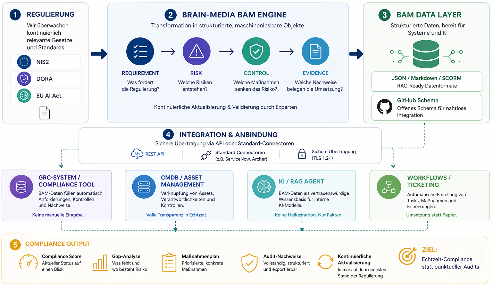

# Brain-Media Audit Model (BAM)

**Executable Compliance – Regulierung als System, nicht als Dokument.**

Das Brain-Media Audit Model (BAM) ist ein maschinenlesbares Wissensmodell für IT-Compliance. Es überführt regulatorische Anforderungen aus NIS-2, DORA, CRA und EU AI Act in strukturierte, direkt umsetzbare Objekte.

---

## Das Modell

Jede regulatorische Anforderung wird in vier operative Ebenen aufgebrochen:

```
Requirement → Risk → Control → Evidence
```

| Ebene | Was es ist | Ihr Nutzen |
|-------|-----------|------------|
| **Requirement** | Regulatorische Anforderung (z. B. NIS-2 Art. 21) | Wissen was gilt – priorisiert und verständlich |
| **Risk** | Risikobewertung mit Likelihood & Impact | Verstehen was auf dem Spiel steht |
| **Control** | Konkrete Maßnahme mit Umsetzungshinweis | Wissen was zu tun ist – direkt umsetzbar |
| **Evidence** | Nachweistyp mit editierbarem Template | Auditoren überzeugen – mit einem Klick |

---

## Schema

Das BAM-Schema liegt unter `schema/bam-schema.json`. Es definiert die Struktur eines BAM-Objekts und kann direkt in GRC-Tools, KI-Systeme und automatisierte Prüfprozesse integriert werden.

Beispiel-Objekte für NIS-2 und DORA liegen unter `examples/`.

---

## Referenzarchitektur

BAM ist darauf ausgelegt, Compliance von einem manuellen Prozess in einen automatisierten Datenstrom zu transformieren. Die folgende Architektur zeigt die Integration in Ihre GRC-Landschaft:



### Integrationspfade:
- **GRC-Systeme:** Automatisierter Import von Anforderungen und Controls.
- **Interne KI (RAG):** Validierte Wissensbasis für Compliance-Abfragen ohne Halluzinationen.
- **Reporting:** Echtzeit-Dashboards statt statischer PDF-Berichte.

---

## Verwendung

BAM-Objekte sind valides JSON und können direkt:

- in GRC-Tools importiert werden
- als RAG-Datenquelle für interne KI-Assistenten genutzt werden
- in automatisierte Compliance-Workflows integriert werden
- als Grundlage für Audit-Nachweise verwendet werden

```json
{
  "bam_version": "1.0",
  "regulation": "NIS-2",
  "article": "Art. 21",
  "requirement": "Risikomanagement-Maßnahmen",
  "risk": {
    "likelihood": "hoch",
    "impact": "kritisch",
    "score": 9
  },
  "control": {
    "measure": "MFA für alle Admin-Konten einführen",
    "priority": "sofort"
  },
  "evidence": {
    "type": "Konfigurationsnachweis",
    "template": "verfügbar in KaaS"
  }
}
```

## Schnellstart: BAM-Integration testen

Um zu sehen, wie Executable Compliance in der Praxis funktioniert, nutzen Sie den mitgelieferten Integrator:

  1. Voraussetzung: Installieren Sie Python (3.8+).

  2. Ausführung: Starten Sie das Beispiel-Skript:
    Bash

    python bam_integrator.py

  3. Ergebnis: Das Skript lädt das bam-example.json, validiert es gegen das Schema und erzeugt einen fertigen Markdown-Report für Ihre Dokumentation.

---

## Was dieses Repository enthält

- `schema/bam-schema.json` – das vollständige BAM-JSON-Schema
- `examples/` – Beispiel-Objekte für NIS-2 und DORA
- `bam_integrator.py – Python-Referenzimplementierung für den Datenimport.
- `LICENSE` – Creative Commons BY-NC 4.0

## Was nicht enthalten ist

Die vollständige BAM-Wissensdatenbank mit allen Anforderungen, Controls, Templates und Checklisten für NIS-2, DORA, CRA und EU AI Act ist ausschließlich über **Knowledge as a Service (KaaS)** verfügbar.

→ [brain-media.de/kaas.html](https://www.brain-media.de/kaas.html)

---

## Über Brain-Media

Dr. Holger Reibold · Informatiker, Fachautor · 30+ Jahre IT-Praxis  
Publiziert in ADMIN Magazine (US), Computerwoche, IT-Administrator, Linux Magazin.

**Executable Compliance.** Kein Dokument.

→ [brain-media.de](https://www.brain-media.de)  
→ [Whitepaper herunterladen](https://www.brain-media.de/Executable_Compliance_White_Paper.pdf)  
→ [Kostenloser Quick-Check](https://www.brain-media.de/bam-check.html)

---

## Lizenz

Creative Commons Attribution-NonCommercial 4.0 International (CC BY-NC 4.0)

Das Schema darf frei genutzt, geteilt und angepasst werden – nicht jedoch für kommerzielle Zwecke ohne ausdrückliche Genehmigung von Brain-Media.

© 2026 Brain-Media.de · Dr. Holger Reibold
